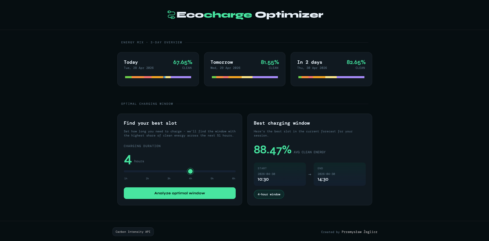

# <span align="center"><samp>Ecocharge Optimizer</samp></span>

Full-stack web application for analyzing UK electricity generation and determining the **optimal EV charging window based on clean energy availability**.

**Live:** [ecocharge.zeglicz.dev](https://ecocharge.zeglicz.dev)



---

## Problem

Electricity carbon intensity fluctuates throughout the day. Charging an EV at the wrong time can significantly increase emissions.

This project identifies **when to charge** by selecting time windows with the highest share of clean energy in the grid.

---

## Core functionality

- **3-day energy mix overview**
  Aggregates half-hour grid data into daily averages and visualizes the share of each energy source.

- **Optimal EV charging window (1–6h)**
  Finds the future time window with the highest average clean energy share.

- **REST API + SPA**
  Backend provides processed data; frontend presents it with interactive charts.

---

## How it works

### Data processing

- Fetch half-hour generation data from the UK Carbon Intensity API
- Group data by day
- Compute average share per energy source

### Charging optimization

- Convert requested duration → number of half-hour slots
- Slide a window across all available future intervals
- Compute average clean energy share for each window
- Select the window with the highest value

Implementation:

- Aggregation: `backend/src/services/generationAggregate.ts`
- Optimization: `backend/src/services/generationOptimalChargingWindow.ts`

---

## Clean energy model

Clean energy sources are explicitly defined as:

- biomass
- nuclear
- hydro
- wind
- solar

This definition is consistently used across aggregation and optimization logic.

---

## Stack

| Layer    | Tech                                                    |
| -------- | ------------------------------------------------------- |
| Frontend | React 19, TypeScript, Vite, styled-components, Recharts |
| Backend  | Node.js, Express 5, TypeScript                          |
| Testing  | Vitest, React Testing Library, Jest, Supertest          |
| Data     | National Grid Carbon Intensity API                      |

---

## Testing

The application includes automated tests across both frontend and backend layers.

### Frontend

Coverage includes:

- API service layer
- Component state rendering
- User interactions
- Loading, success and error flows
- Charging window analysis workflow

### Backend

Coverage includes:

- Route handlers
- External API integration
- Aggregation logic
- Charging optimization algorithm
- Custom error handling
- Date utilities

The core business logic responsible for energy aggregation and optimal charging window calculation is covered by dedicated unit tests.

---

## Project structure

```
backend/    Express API, data processing, optimization logic
frontend/   React SPA (Vite)
docs/       README assets
```

---

## API

### `GET /api/v1/generation/daily`

Returns 3-day aggregated energy mix.

### `GET /api/v1/generation/charging-window?hours=N`

- `N`: integer (1–6)
- Returns:
  - start date & time
  - end date & time
  - average clean energy percentage

### Errors

- `400` — invalid or missing `hours`
- `422` — insufficient future data
- `500` — upstream API or server failure

---

## Local setup

### Backend

```bash

cd backend
cp .env.example .env
npm install
npm run start:dev
```

Default: http://localhost:7650

### Frontend

```bash
cd frontend
npm install
npm run dev
```

---

## License

Portfolio / educational use. External data subject to Carbon Intensity API terms.
